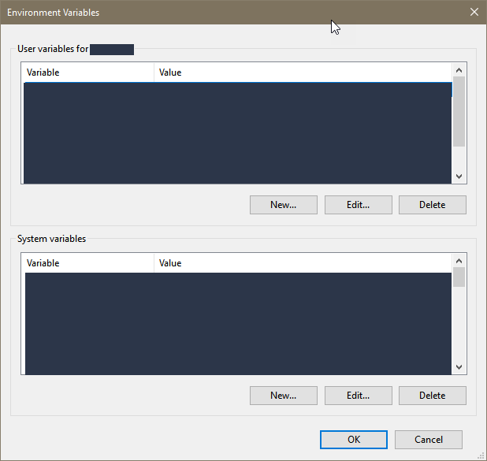
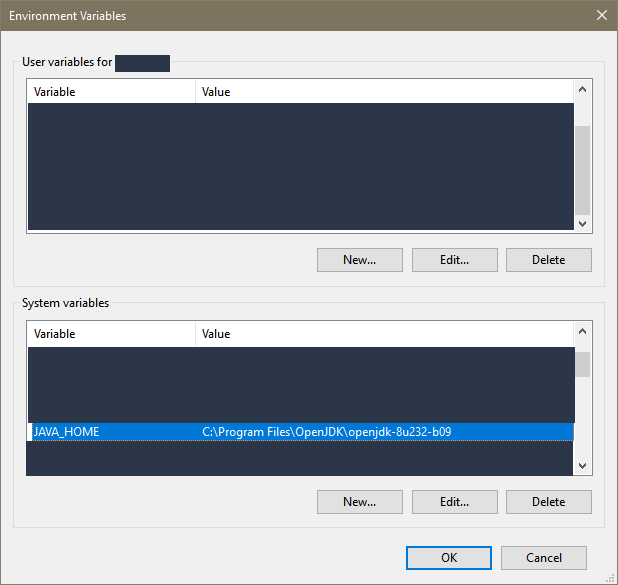
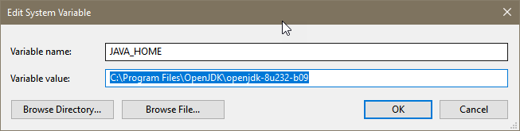
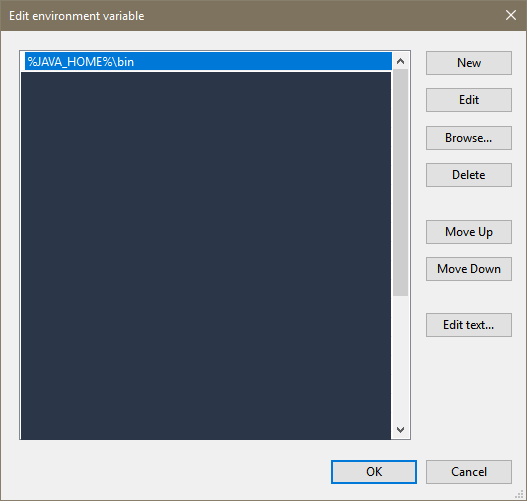
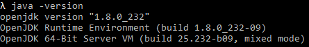
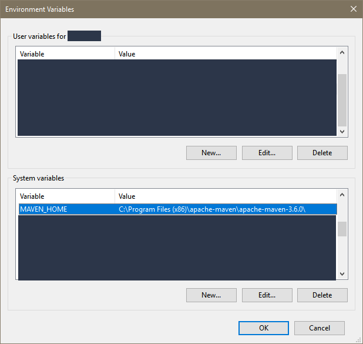
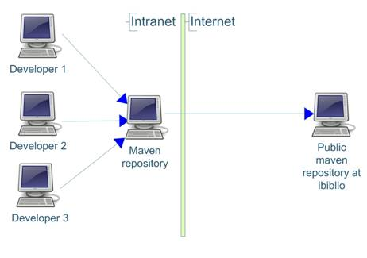

# hello-maven

This repository contains simple example of maven project.

## Introduction to maven
### Introduction ([source](https://maven.apache.org/what-is-maven.html))
Maven, a [Yiddish word](https://en.wikipedia.org/wiki/Maven) meaning *accumulator of knowledge*, began as an attempt to simplify the build processes in the Jakarta Turbine project. There were several projects, each with their own Ant build files, that were all slightly different. JARs were checked into CVS. We wanted a standard way to build the projects, a clear definition of what the project consisted of, an easy way to publish project information and a way to share JARs across several projects.
The result is a tool that can now be used for building and managing any Java-based project. We hope that we have created something that will make the day-to-day work of Java developers easier and generally help with the comprehension of any Java-based project.

### Maven’s Objectives ([source](https://maven.apache.org/what-is-maven.html))
Maven’s primary goal is to allow a developer to comprehend the complete state of a development effort in the shortest period of time. In order to attain this goal, there are several areas of concern that Maven attempts to deal with:
* Making the build process easy
* Providing a uniform build system
* Providing quality project information
* Providing guidelines for best practices development
* Allowing transparent migration to new features

### Requirements to use maven locally
 * Java JDK installed
 * Newest, version of [Maven](https://maven.apache.org/download.cgi) installed.
 
### How to install Maven
1. Download and install Java JDK ([Oracle Java JDK](https://www.oracle.com/java/technologies/javase-jdk8-downloads.html), 
[OpenJDK](https://openjdk.java.net/install/) or other provider)
    1. You can download and install it following the instructions of Java implementation provider
        1. After installation, you might need to set up `Environment Variable`. To do this follow next steps.
        2. Open `System Properties` > `Advanced` > `Environment Variable`
        
         
        
        
        
        3. Search for variable `JAVA_HOME`. Example of correct set up: 
        
         
        
         
        
        If not exist you will need to set up it manually.
        
        4. Also, check if variable `Path` contains record related to `JAVA_HOME`.
        
         
        
        You should add record `%JAVA_HOME%\bin` to `Path` variable if not exist. 
    2. Use [chocolatey](https://chocolatey.org/) (package manage for Windows)
        1. Search for JDK which you need then use provided command - Example: `choco install openjdk8`
2. To Verify if Java installed correctly run this command `java -version`. Example:

3. Download Maven and add `MAVEN_HOME` to `Environment Variables`. You can any location on you drive for Maven.

4. Add `%MAVEN_HOME%\bin` to `Path` variable.

### Maven repository - General overview
